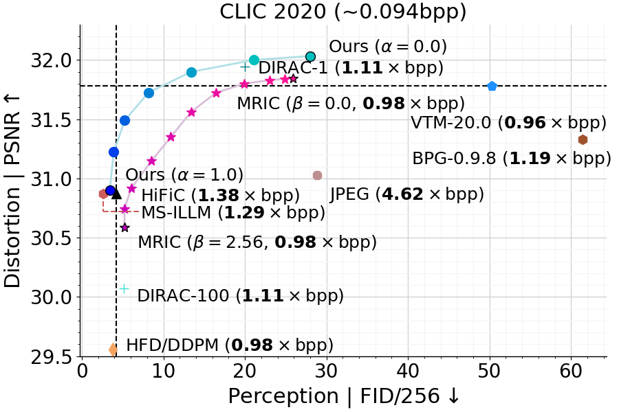

# EGIC (TensorFlow 2)

[](https://colab.research.google.com/drive/1obTQiWl0FCbp2rSXquHeL0KnoSHO6yxz?usp=sharing)
[](https://nikolai10.github.io/EGIC-Project-Page/)
[](https://arxiv.org/abs/2309.03244)


This repository provides a TensorFlow 2 implementation of [EGIC: Enhanced Low-Bit-Rate Generative Image Compression Guided by Semantic Segmentation (ECCV 2024)](https://www.springerprofessional.de/en/egic-enhanced-low-bit-rate-generative-image-compression-guided-b/50057954)
.

## Abstract

We introduce EGIC, an enhanced generative image compression method that allows traversing the distortion-perception
curve efficiently from a single model. EGIC is based on two novel building blocks: i) OASIS-C, a conditional pre-trained
semantic segmentation-guided discriminator, which provides both spatially and semantically-aware gradient feedback to
the generator, conditioned on the latent image distribution, and ii) Output Residual Prediction (ORP), a retrofit
solution for multi-realism image compression that allows control over the synthesis process by adjusting the impact of
the residual between an MSE-optimized and GAN-optimized decoder output on the GAN-based reconstruction. Together, EGIC
forms a powerful codec, outperforming state-of-the-art diffusion and GAN-based methods (e.g., HiFiC, MS-ILLM, and
DIRAC-100), while performing almost on par with VTM-20.0 on the distortion end. EGIC is simple to implement, very
lightweight, and provides excellent interpolation characteristics, which makes it a promising candidate for practical
applications targeting the low bit range.

<div align=center>

</div>


<p align="center"><em>Distortion-perception comparison. Top left is best.</em></p>

## Updates

***03/11/2024***

1. Initial release of this project

## Install

```bash
$ git clone https://github.com/Nikolai10/EGIC.git 
```

Please follow our [Installation Guide with Docker](docker/install.txt).

## Training/ Inference

Please have a look at the [example Colab notebook](./notebooks/SwinT-ChARM-Perceptual.ipynb) for more information.

We use the Coco2017 training dataset by default. Please familiarize yourself with the [data preparation and loading mechanisms](https://github.com/google-research/deeplab2/blob/main/g3doc/setup/coco.md) 
and adjust the file paths and training settings in [config.py](./src/config.py) and [resnet50_os32_semseg_coco.textproto](src/deeplab2/configs/custom/resnet50_os32_semseg_coco.textproto) accordingly.

We also provide a simplified Google Colab demo that uses a tiny subset of pre-computed tf-records, with no data engineering tasks involved: [open tutorial](https://colab.research.google.com/drive/1obTQiWl0FCbp2rSXquHeL0KnoSHO6yxz?usp=sharing).

## Output Residual Prediction

We provide a separate [notebook](./notebooks/ORP.ipynb) to demonstrate how to retrofit a pre-trained EGIC model to the multi-realism case. The corresponding Google Colab demo can be found [here](https://colab.research.google.com/drive/1aeXFFq-BZZeGbmgQupLoozErUsePlHgy?usp=sharing).

## Pre-trained Models/ Data

Download [link](https://drive.google.com/drive/folders/1qHEpo-rVRavAb0p6qL2KdLCu0TmHilEt?usp=sharing).

## File Structure

     docker                                             # Docker functionality
         ├── install.txt                                
     notebooks                                          # jupyter-notebooks
         ├── SwinT-ChARM-Perceptual.ipynb               # How to train and eval EGIC
         ├── ORP.ipynb                                  # How to retrofit EGIC to the multi-realism case
     res                                                
         ├── data/                                      # training + evaluation data (must be downloaded/ prepared separately)
             ├── clic2020/                              # CLIC 2020 dataset (https://www.compression.cc/, mobile + professional partitions, 428 images)
             ├── coco2017/                              # Coco2017 dataset stored as tf records, see https://github.com/google-research/deeplab2/blob/main/g3doc/setup/coco.md
             ├── DIV2K_valid_HR/                        # DIV2K dataset (https://data.vision.ee.ethz.ch/cvl/DIV2K/, 100 images)
             ├── kodak                                  # Kodak dataset (https://r0k.us/graphics/kodak/, 24 images)
         ├── eval/                                      # sample images + reconstructions
         ├── models/                                    # pre-trained models (lpips_weights, oasis_n+1_256x256_coco_weightnorm)
         ├── doc/                                       # addtitional resources
         ├── kkshms2024                                 # saved model
         ├── train_kkshms2024                           # model checkpoints + tf.summaries
     src
         ├── deeplab2/                                  # modified Deeplab2 version (https://github.com/google-research/deeplab2) 
         ├── swin-transformers-tf/                      # extended swin-transformers-tf implementation
         ├── archs.py                                   # Core neural network blocks
         ├── coco_utils.py                              # COCO meta data
         ├── config.py                                  # global + SwinT-ChARM configuration
         ├── eval_utils.py                              # evaluate dataset (bpp, PSNR)
         ├── helpers.py                                 # some helper functionality
         ├── kkshms2024.py                              # training/ compression functionality (wo ORP)
         ├── kkshms2024_orp.py                          # training/ compression functionality (w ORP)
         ├── loss.py                                    # loss implementations
         ├── oasis_c.py                                 # OASIS-C implementation

## Acknowledgment

This project is based on:

- [TensorFlow Compression (TFC)](https://github.com/tensorflow/compression), a TF library dedicated to data compression.
  Particularly, we base our work on the well
  known [MS2020](https://github.com/tensorflow/compression/blob/master/models/ms2020.py)
  and [HiFiC](https://github.com/tensorflow/compression/tree/master/models/hific), while closely following the official
  structure.
- [NeuralCompression](https://github.com/facebookresearch/NeuralCompression), a Python repository dedicated to research
  of neural networks that compress data (we make use of the FID/ KID computations).
- [Deeplab2](https://github.com/google-research/deeplab2), a TensorFlow library for deep labeling, aiming to provide a
  unified and state-of-the-art TensorFlow codebase for dense pixel labeling tasks.
- [OASIS](https://github.com/boschresearch/OASIS), Official implementation of the paper "You Only Need Adversarial
  Supervision for Semantic Image Synthesis" (ICLR 2021).

## License

[Apache License 2.0](LICENSE)